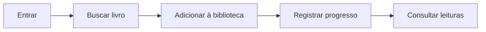

# BookLog


[](https://github.com/GabrielBuck/Lab-engenharia-de-software/actions/workflows/ci.yml)

**Laboratório de Engenharia de Software · Primeira entrega**

BookLog é um aplicativo para organizar livros desejados, em leitura e concluídos. Este repositório reúne a especificação do produto e os artefatos de engenharia que orientam seu desenvolvimento.

**[Conheça a primeira entrega](docs/entregas/primeira-entrega.md)** · **[Explore a documentação](docs/README.md)** · **[Consulte a rastreabilidade](docs/02-requisitos/rastreabilidade.md)**

## O projeto

Listas dispersas e registros de progresso desconectados dificultam escolher e retomar uma leitura. O BookLog conecta descoberta, organização e acompanhamento em uma biblioteca pessoal.

O recorte inicial contempla sete funcionalidades: cadastro, autenticação, busca de livros, adição à biblioteca, alteração de status, registro de progresso e consulta da biblioteca.



## Primeira entrega

A entrega apresenta a concepção e a especificação do BookLog, com critérios de aceite e vínculos entre requisitos, modelos e testes.

| Frente | Conteúdo | Acesso |
| --- | --- | --- |
| Produto | Problema, escopo, proposta de valor e duas personas | [Visão do produto](docs/01-visao-produto/visao-produto.md) |
| Requisitos | 7 RF, 7 RNF, 7 regras de negócio e rastreabilidade | [Requisitos](docs/02-requisitos/requisitos-funcionais.md) |
| Casos de uso | 5 narrativas com fluxos principais, alternativas e diagrama UML | [Casos de uso](docs/03-casos-de-uso/README.md) |
| Design | Jornada e 4 wireframes de baixa fidelidade | [Wireframes](docs/04-design/wireframes/README.md) |
| Modelagem | Classes de domínio e sequência de atualização de progresso | [Modelo de domínio](docs/05-modelagem/modelo-dominio.md) |
| Arquitetura | Componentes, pacotes, implantação e 4 decisões arquiteturais | [Arquitetura](docs/06-arquitetura/visao-arquitetural.md) |
| Processo e qualidade | Registro documental, planejamento e 12 cenários de teste | [Primeira entrega](docs/entregas/primeira-entrega.md) |

Os artefatos especificam o comportamento esperado. Os wireframes são conceituais e o plano de testes descreve cenários de verificação; a CI valida a documentação. A implementação de referência é mantida no [backend do BookLog](https://github.com/Bin4ryLibr4ry/booklog-backend).

## Equipe

| Integrante | RA |
| --- | --- |
| Gabriel Nottoli Buck | 10425384 |
| Julia Andrade | 10427828 |

## Tecnologias

| Camada | Tecnologia |
| --- | --- |
| Cliente de referência | Aplicativo iOS |
| Backend de referência | NestJS, TypeScript, REST, JWT e bcrypt |
| Persistência de referência | PostgreSQL e adapter em memória |
| Artefatos | Markdown, Mermaid e SVG |
| Validação documental | Node.js 22 e GitHub Actions |

## Navegação e execução

A documentação pode ser consultada diretamente no GitHub, incluindo os diagramas Mermaid e wireframes SVG. O [índice](docs/README.md) oferece acesso a todos os artefatos; o [roteiro da primeira entrega](docs/entregas/primeira-entrega.md) organiza a apresentação.

Para validar localmente:

```bash
git clone https://github.com/GabrielBuck/Lab-engenharia-de-software.git
cd Lab-engenharia-de-software
node scripts/validate-docs.mjs
```

Requer Node.js 22 ou superior, sem instalação de dependências npm. A mesma verificação é executada em pushes e pull requests.

Para executar a API, consulte as [instruções do backend](https://github.com/Bin4ryLibr4ry/booklog-backend#como-rodar-localmente).

## Organização

```text
docs/
├── README.md                  Índice dos artefatos
├── entregas/                  Guia da primeira entrega
├── 01-visao-produto/           Problema, valor e personas
├── 02-requisitos/              Especificação e rastreabilidade
├── 03-casos-de-uso/            UML e narrativas
├── 04-design/                 Jornada e wireframes
├── 05-modelagem/              Domínio e sequência
├── 06-arquitetura/             Visões e decisões
└── 07-sprints/                 Registro e planejamento
tests/                         Plano de testes
assets/                        Identidade visual e índice de diagramas
scripts/                       Validação documental
.github/workflows/             Integração contínua
```

O [guia de contribuição](CONTRIBUTING.md) descreve o fluxo de trabalho. As [fontes](docs/fontes-e-premissas.md) registram a origem das referências técnicas.
