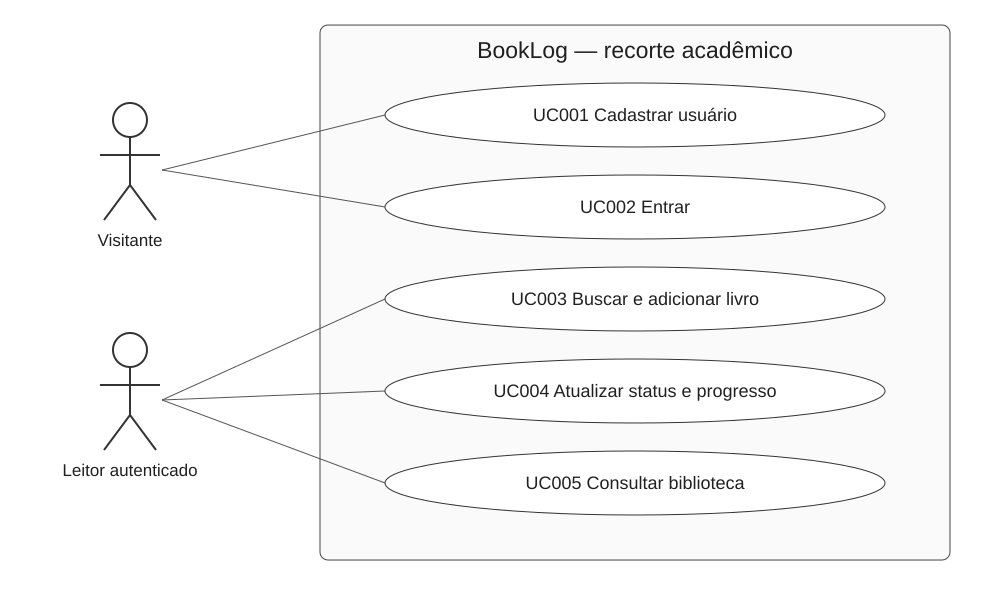

# Casos de uso

O ator Visitante pode cadastrar-se e entrar. O Leitor autenticado busca/adiciona livros, consulta a biblioteca e registra progresso. A API constitui parte do sistema, não um ator humano.

- [UC001 — Cadastrar usuário](casos-uso/UC001-cadastrar-usuario.md)
- [UC002 — Entrar no BookLog](casos-uso/UC002-login.md)
- [UC003 — Buscar e adicionar livro](casos-uso/UC003-gerenciar-biblioteca.md)
- [UC004 — Atualizar status e progresso](casos-uso/UC004-registrar-progresso.md)
- [UC005 — Consultar biblioteca](casos-uso/UC005-consultar-biblioteca.md)

O SVG é editável como texto. Linhas contínuas representam associações ator–caso; não foram introduzidas relações include/extend sem necessidade. Os fluxos e exceções estão nas narrativas.

---

[Índice da documentação](../README.md) · [Página do projeto](../../README.md)
