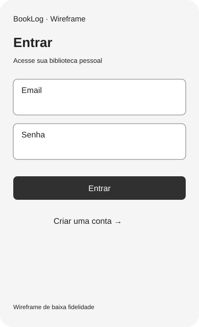
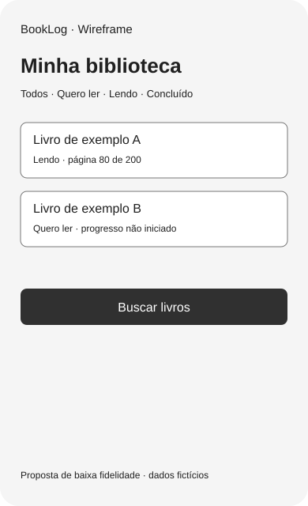
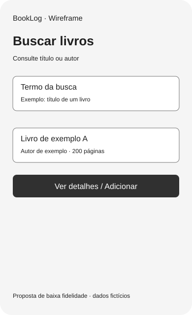
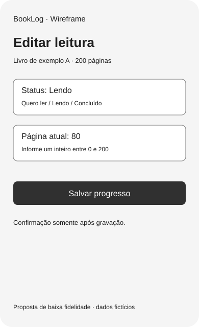

# Wireframes de baixa fidelidade
Proposta inicial; textos e estados não representam dados reais. Abra os SVGs no navegador.

## Estados para implementação
| Tela | Carregando | Vazio | Erro | Sucesso |
| --- | --- | --- | --- | --- |
| Entrada | Desabilitar envio em curso | Campos ainda não preenchidos | Credenciais inválidas / rede | Abrir biblioteca |
| Biblioteca | Indicador de carregamento | Convite para buscar | Tentar novamente | Itens e filtros |
| Busca | Indicador de busca | Nenhum livro encontrado | Catálogo indisponível | Resultados e adição |
| Progresso | Salvando | Página ainda não informada | Validar limite / tentar novamente | Confirmar gravação |

Os SVGs mostram um estado principal por tela. Estados alternativos estão especificados na tabela e nos casos de uso.
