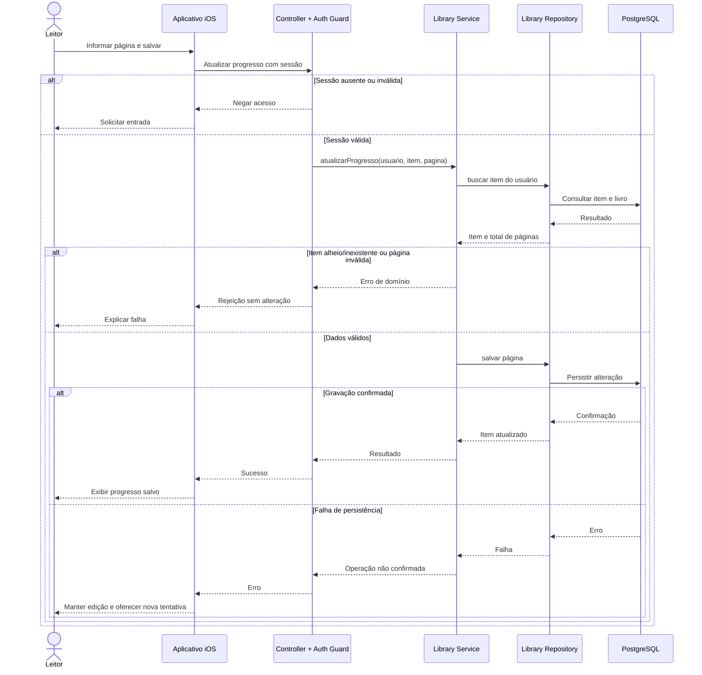

# Sequência — registrar progresso

Cenário UC004; arquitetura proposta. A chamada é conceitual e não substitui o contrato HTTP.

---

[Índice da documentação](../../README.md) · [Página do projeto](../../../README.md)
