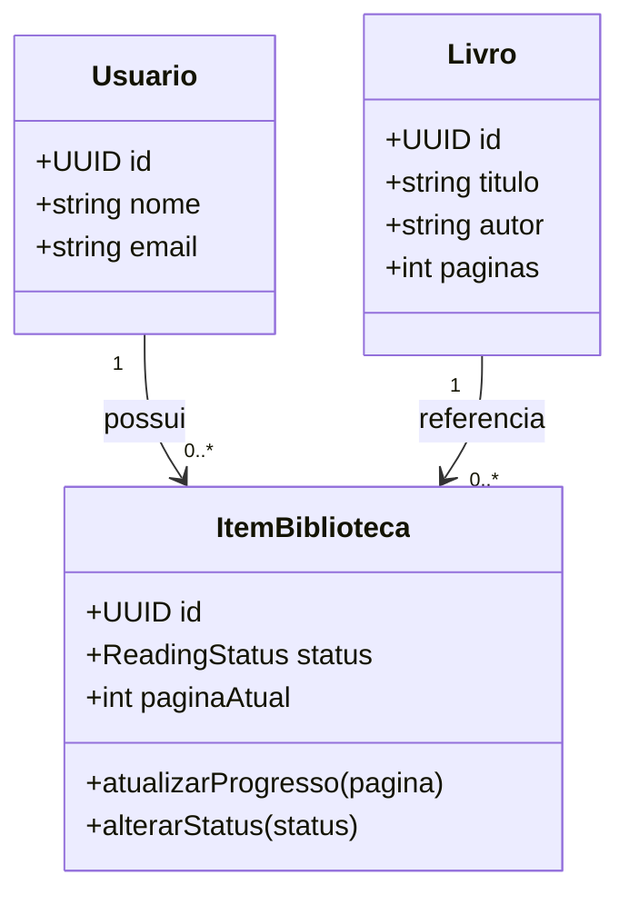

# Modelo de domínio
Modelo conceitual do recorte, não esquema reverso do backend.

| Entidade | Responsabilidade |
| --- | --- |
| Usuario | Identidade do leitor e vínculo com sua biblioteca |
| Livro | Metadados compartilhados de uma edição |
| ItemBiblioteca | Relação usuário/livro, status e página atual |

## Invariantes
O par usuário/livro é único (RN003). Cada item pertence a exatamente um usuário e referencia exatamente um livro. O total de páginas pode ser desconhecido; nesse caso o percentual não é calculado. Página atual segue RN005.

Credenciais não aparecem neste diagrama conceitual; o componente Auth é responsável pelo fluxo de autenticação. Não incluir senha em texto puro no modelo de persistência.

Veja a [sequência](diagrama-sequencia/registrar-progresso.md). Resenhas, clubes e empréstimos serão modelados apenas quando entrarem no escopo.
