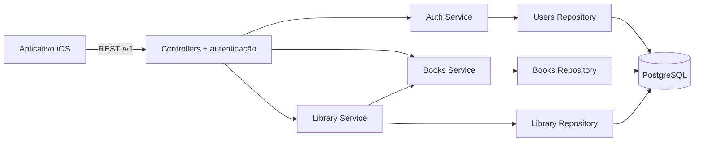

# Diagrama de componentes

Visão lógica proposta do recorte; integração externa de catálogo é opcional.

```mermaid
flowchart LR
  App["Aplicativo iOS"] -->|REST /v1| API["Controllers + autenticação"]
  API --> Auth["Auth Service"]
  API --> Books["Books Service"]
  API --> Library["Library Service"]
  Auth --> UsersRepo["Users Repository"]
  Books --> BooksRepo["Books Repository"]
  Library --> LibraryRepo["Library Repository"]
  Library --> Books
  UsersRepo --> DB[("PostgreSQL")]
  BooksRepo --> DB
  LibraryRepo --> DB
```

---

[Índice da documentação](../README.md) · [Página do projeto](../../README.md)
