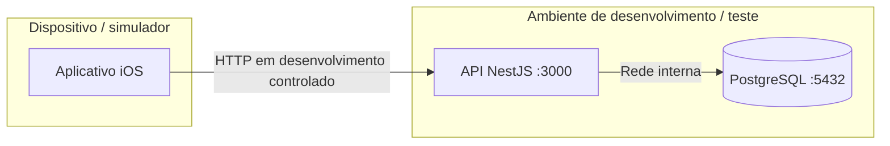

# Diagrama de implantação
Topologia proposta para teste integrado. Não representa infraestrutura publicada.

Para exposição remota, usar HTTPS e restringir o banco à rede interna. Configurar URL da API conforme simulador/dispositivo; localhost no dispositivo não aponta para a máquina do backend.
