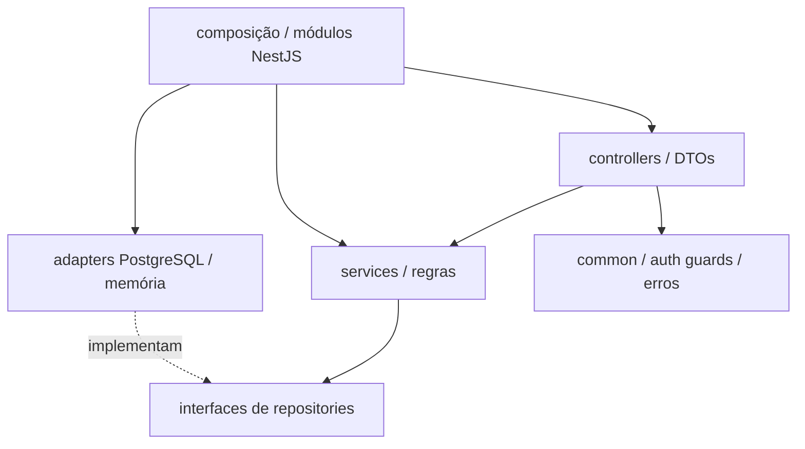

# Diagrama de pacotes
Organização lógica inspirada no backend de referência; as pastas acadêmicas ainda contêm apenas documentação.

Dependências concretas são resolvidas pela composição dos módulos. Evitar regras de negócio no cliente e nos controllers.
